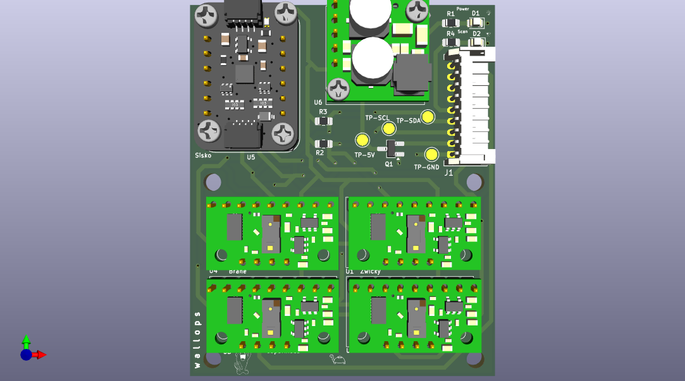

# WALLOPS
## Wide Angle LiDAR Laser Operating in Pressurized Space

### Part of College of the Canyons' RockSat 2026 Payload that will be integrated onto a NASA Wallops Sounding Rocket

Connects to a **Raspberry Pi 5** on the Machine Learning Suite board.

Goal is to collect distance data from 4 VL53L8CX 8x8 near infrared sensors to translate into point cloud and recreate pressurized payload on sounding rocket, as well as generate the parts of the payload (e.g. backs of mounted objects) that cannot be observed by the scan using machine learning.
